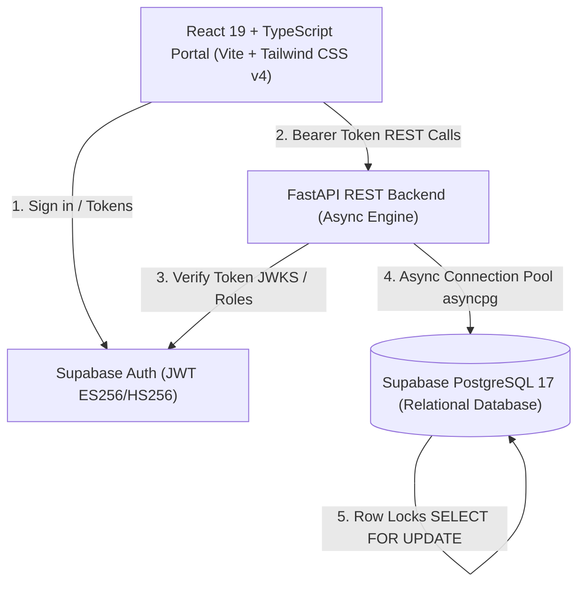

# Apex Wholesale Operations Portal — Mini ERP & CRM System

A production-grade, full-stack **Mini ERP + CRM Operations Portal** engineered for wholesale and distribution enterprises. Built to streamline customer relationships, live warehouse inventory, sales dispatch challans, and stock audit ledgers with strict role-based access control and transactional integrity.

---

## 🏗️ Architectural Overview



### Core Technology Stack

- **Frontend**: React 19, TypeScript, Vite, Tailwind CSS v4, Axios, React Router v7.
  - *Faithfully transformed from Google Stitch designs into responsive, high-density ERP components.*
- **Backend**: Python 3.12, FastAPI, `asyncpg` connection pooling, Pydantic v2.
- **Database & Auth**: PostgreSQL 17 via Supabase, Row-Level Security, Supabase Auth with JWKS verification.
- **Deployment**: Configured for serverless deployment on Vercel (`@vercel/python` ASGI backend and static frontend).

---

## 🔑 Pre-Configured Test Accounts (Live)

The database includes live provisioned accounts across all enterprise roles with active sessions:

| Role | Email | Password | Allowed Capabilities |
| :--- | :--- | :--- | :--- |
| **Admin** | `admin@apex.in` | `Admin@123` | Full administrative control across CRM, Catalog, Inventory, Challans, and Users. |
| **Sales** | `sales@apex.in` | `Sales@123` | Customer CRM management, follow-up scheduling, drafting and confirming Sales Challans. |
| **Warehouse** | `warehouse@apex.in` | `Warehouse@123` | Product catalog creation, Goods Receipt Notes (GRN stock inward), dispatch verification. |

---

## 🛡️ Concurrency & Stock Protection Engine

Wholesale operations require ironclad stock management to prevent backorders, ghost dispatches, and negative warehouse balances.

### 1. Atomic Row-Level Locking
When confirming a sales challan (`POST /api/challans/{id}/confirm`):
```sql
-- Lock product rows within the transaction to prevent race conditions
SELECT id, name, current_stock, minimum_stock 
FROM products 
WHERE id = ANY($1::uuid[]) 
FOR UPDATE;
```

### 2. Deficit Interception & Guard Rails
- If any requested SKU balance is lower than the order requirement, the transaction **immediately rolls back** and returns a structured `400 Bad Request`:
```json
{
  "detail": {
    "error": "Insufficient stock for 'High-Tensile Steel Hex Bolt M12 x 50mm'",
    "product": "High-Tensile Steel Hex Bolt M12 x 50mm",
    "available": 2140,
    "requested": 7540
  }
}
```
- In the frontend UI, real-time availability warnings appear on the creation form, with a one-click **"Auto-Fit to Max Available"** button to adjust quantities instantly.

### 3. Comprehensive Audit Trail
Every stock adjustment automatically records a permanent ledger row in `stock_movements`:
- `movement_type`: `IN` (GRN / purchase inward) or `OUT` (sales dispatch).
- `quantity`: Signed magnitude.
- `reason` & `created_by`: User attribution and reference tracking.

---

## 👥 Role-Based Access Control (RBAC) Matrix

| Module / Action | Admin | Sales | Warehouse |
| :--- | :---: | :---: | :---: |
| **View Dashboard & Metrics** | ✅ | ✅ | ✅ |
| **View Customer Directory** | ✅ | ✅ | ✅ |
| **Create / Edit Customers** | ✅ | ✅ | ❌ |
| **Log CRM Follow-up Notes** | ✅ | ✅ | ❌ |
| **View Product Catalog & Live Stock** | ✅ | ✅ | ✅ |
| **Create Products / Modify Prices** | ✅ | ❌ | ✅ |
| **Record Stock Inward (GRN)** | ✅ | ❌ | ✅ |
| **Draft Sales Challan** | ✅ | ✅ | ❌ |
| **Validate & Confirm Challan (Deduct Stock)** | ✅ | ✅ | ❌ |
| **Cancel Challan (Restock Products)** | ✅ | ✅ | ❌ |
| **Export Stock Movement Audit Ledger** | ✅ | ✅ | ✅ |

---

## 🚀 Local Development Setup

### Prerequisites
- Python 3.12+
- Node.js 20+ & npm

### 1. Backend Setup
```bash
cd backend
python -m venv .venv
source .venv/bin/activate
pip install -r requirements.txt

# Run FastAPI dev server
uvicorn app.main:app --reload --port 8000
```
- Interactive API Documentation (Swagger UI): [http://localhost:8000/docs](http://localhost:8000/docs)
- Alternative Redoc: [http://localhost:8000/redoc](http://localhost:8000/redoc)

### 2. Frontend Setup
```bash
cd frontend
npm install
npm run dev
```
- Operations Portal: [http://localhost:5173](http://localhost:5173)

---

## 🧪 Automated End-to-End Test Suite

Run the full integration test suite verifying all 9 enterprise business flows against live Supabase PostgreSQL:
```bash
.venv/bin/python scratch/test_api_flows.py
```

**Verified Test Scenarios**:
1. **Auth & RBAC**: Multi-role authentication and forbidden role guards.
2. **Customer CRM**: Customer creation with GSTIN, company details, and scheduled follow-ups.
3. **Products & Inventory**: Catalog querying with live stock levels.
4. **Draft Challans**: Creation without affecting physical inventory.
5. **Atomic Confirmation**: Row-locking stock decrement and outward movement audit logging.
6. **Negative Stock Interception**: Immediate blockage on deficit orders.
7. **Warehouse Operations**: Inward GRN receipt with instant balance increment.
8. **Dashboard Engine**: Live metric counters, low-stock alerts, and recent activities.

---

## 📦 Postman Collection

Import [`Apex_Wholesale_ERP.postman_collection.json`](file:///home/jenevanthm/Development/erp-crm/Apex_Wholesale_ERP.postman_collection.json) into Postman to test the full REST API suite across all endpoints with pre-configured request samples.

---

## ☁️ Vercel Deployment Guide

### Backend Deployment
1. Set Project Root to `backend`.
2. Framework Preset: `Other`.
3. Configure Environment Variables:
   - `DATABASE_URL`
   - `SUPABASE_URL`
   - `SUPABASE_ANON_KEY`
   - `SUPABASE_JWT_SECRET`

### Frontend Deployment
1. Set Project Root to `frontend`.
2. Framework Preset: `Vite`.
3. Configure Environment Variables:
   - `VITE_API_URL`
   - `VITE_SUPABASE_URL`
   - `VITE_SUPABASE_ANON_KEY`
