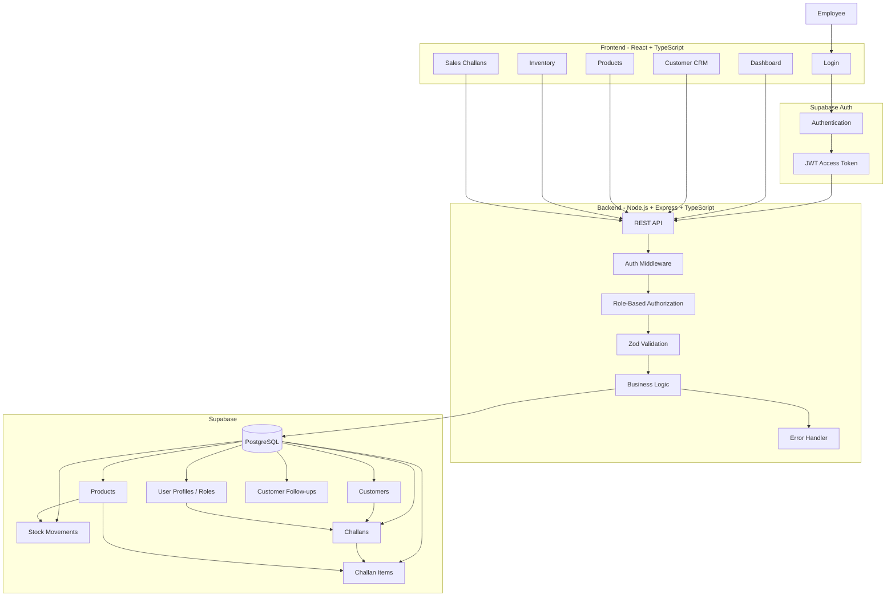
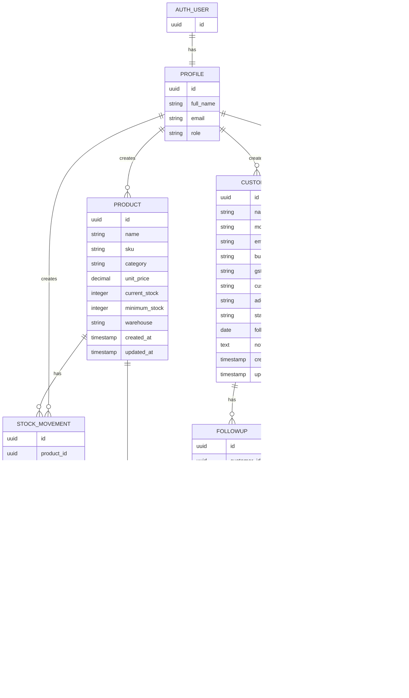
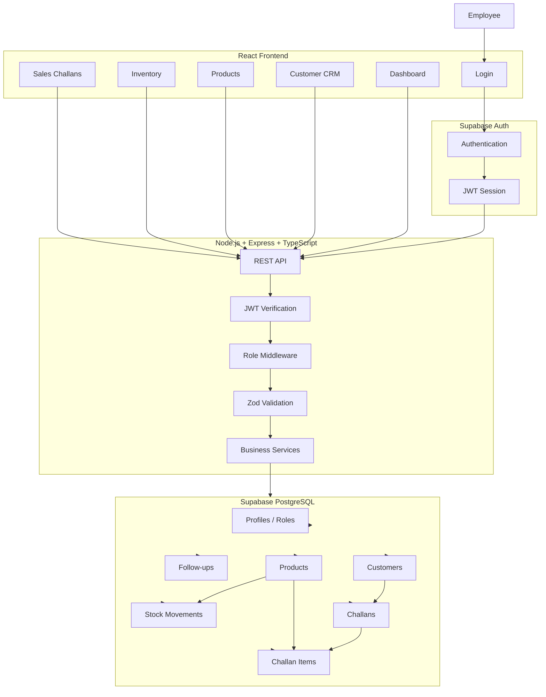

Yes. I would build this as a **small but professional internal ERP**, with Supabase handling the infrastructure-heavy pieces and a real Node/Express backend sitting between the React UI and the database.

The case study gives you only 48 hours, and its real evaluation points are the business flow, REST API quality, validation, roles, stock logic, database design, deployment, and documentation—not how many features you can cram in. 

One important architectural decision first:

> **Do not make React talk directly to every Supabase table.**

Use Supabase for **Auth + PostgreSQL**, but keep **Node.js/Express as your application API**. That way you genuinely satisfy the "REST APIs / backend business logic" requirement and can demonstrate proper stock validation and authorization. The assignment explicitly expects a Node.js/TypeScript backend with REST APIs. 

Supabase supports React authentication directly, PostgreSQL, and Row Level Security. ([Supabase][1])

---

# 1. The stack I recommend

Keep it simple.

| Layer               | Technology                         | Why                                                      |
| ------------------- | ---------------------------------- | -------------------------------------------------------- |
| UI design           | **Google Stitch**                  | Rapidly create a coherent admin dashboard design         |
| Frontend            | **React + TypeScript + Vite**      | Required stack, fast to build                            |
| UI styling          | **Tailwind CSS + shadcn/ui**       | Fast professional admin UI                               |
| Backend             | **Node.js + TypeScript + Express** | Simple, exactly matches requirement                      |
| Validation          | **Zod**                            | Clean request validation                                 |
| Auth                | **Supabase Auth**                  | You don't need to build password authentication yourself |
| Database            | **Supabase PostgreSQL**            | Required relational database + easy hosting              |
| DB access           | **`pg`** from backend              | Gives you proper transactions for stock operations       |
| API testing         | **Postman**                        | Required/expected submission artifact                    |
| Version control     | **Git + GitHub**                   | Required                                                 |
| Frontend deployment | **Vercel**                         | Simple                                                   |
| Backend deployment  | **Render**                         | Simple                                                   |
| Database/Auth       | **Supabase**                       | Already hosting both                                     |
| Optional            | Docker                             | Bonus                                                    |
| Optional            | GitHub Actions                     | Bonus                                                    |

Google's current Stitch workflow is particularly useful here because it can generate high-fidelity UI from natural-language descriptions and can also produce frontend code/prototypes; Google has continued expanding it into a multi-screen design canvas. ([Google Developers Blog][2])

---

# 2. The architecture I would use

This is the architecture I recommend you actually implement:



### The key idea

```text
React
   ↓
JWT
   ↓
Node/Express API
   ↓
Authorization + Validation
   ↓
Business Logic
   ↓
PostgreSQL
```

Not:

```text
React
   ↓
Supabase tables directly
```

The second approach would be easier, but it doesn't showcase the backend engineering this assignment specifically asks for.

---

# 3. How Supabase fits in

Supabase is doing **three jobs** for you:

### Authentication

Supabase Auth handles:

```text
Email
Password
Login
Session
JWT
Logout
```

Supabase officially supports React through `@supabase/supabase-js`. ([Supabase][1])

### PostgreSQL

Your actual business data lives here:

```text
users/profile
customers
products
stock_movements
challans
challan_items
followups
```

### Optional security layer

Supabase PostgreSQL supports Row Level Security, allowing database-level policies as an additional security layer. ([Supabase][3])

Your **Node backend**, however, remains responsible for your application's role permissions and business operations.

---

# 4. Don't create your own authentication system

This is one area where Supabase saves you a lot of time.

You don't need to build:

```text
password hashing
JWT creation
refresh tokens
forgot password
session handling
```

Supabase Auth already handles this.

Your database should have something like:

```text
profiles

id
full_name
email
role
created_at
```

where:

```text
role =
ADMIN
SALES
WAREHOUSE
ACCOUNTS
```

The authentication identity comes from Supabase Auth; your `profiles` table stores your application's additional information/role.

---

# 5. Your database

I would create these tables.



The last three snapshot fields are particularly important because the assignment explicitly says the challan must store product snapshot data rather than relying only on `product_id`. 

---

# 6. The business logic you absolutely must get right

This is the part I would spend the most engineering effort on.

Suppose:

```text
Keyboard stock = 10
```

A sales employee creates:

```text
Challan
Keyboard × 6
```

### Draft

```text
Challan = DRAFT
Stock = 10
```

Nothing changes.

### Confirm

Backend checks:

```text
10 >= 6 ?
```

Yes.

Then atomically:

```text
Stock = 4

Create Challan
Create Challan Item
Create OUT Stock Movement
```

The requirement explicitly says confirmation reduces stock and stock cannot go negative. 

---

If:

```text
Stock = 4
Requested = 8
```

then:

```text
❌ Insufficient stock

Available: 4
Requested: 8
```

and **nothing gets partially saved**.

This should be implemented using a PostgreSQL transaction from your Node backend.

Conceptually:

```text
BEGIN

Lock/read product stock

Check requested quantity

IF insufficient:
    ROLLBACK
    return error

Update stock

Insert challan

Insert challan items

Insert stock movement

COMMIT
```

That is a very good thing to be able to explain during the interview.

---

# 7. Your Node backend structure

Don't make one huge `server.ts`.

Use:

```text
backend/
│
├── src/
│   ├── config/
│   │   ├── env.ts
│   │   └── database.ts
│   │
│   ├── middleware/
│   │   ├── auth.ts
│   │   ├── authorize.ts
│   │   └── errorHandler.ts
│   │
│   ├── modules/
│   │   ├── auth/
│   │   ├── customers/
│   │   ├── products/
│   │   ├── inventory/
│   │   └── challans/
│   │
│   ├── routes/
│   │   └── index.ts
│   │
│   ├── utils/
│   │
│   └── app.ts
│
├── .env
├── .env.example
├── package.json
└── tsconfig.json
```

For each module:

```text
customers/
├── customer.controller.ts
├── customer.service.ts
├── customer.repository.ts
├── customer.schema.ts
└── customer.routes.ts
```

That makes your architecture much easier to explain.

---

# 8. APIs you should build

### Auth

Supabase handles authentication, but your backend still needs to accept/verify the access token.

```http
POST /api/auth/profile
GET  /api/auth/me
```

### Customers

```http
GET    /api/customers
GET    /api/customers/:id
POST   /api/customers
PUT    /api/customers/:id
POST   /api/customers/:id/followups
GET    /api/customers/:id/followups
```

### Products

```http
GET    /api/products
GET    /api/products/:id
POST   /api/products
PUT    /api/products/:id
```

### Inventory

```http
GET /api/inventory
GET /api/inventory/movements
```

### Challans

```http
GET  /api/challans
GET  /api/challans/:id
POST /api/challans
POST /api/challans/:id/confirm
POST /api/challans/:id/cancel
```

This is more than enough for the assignment.

---

# 9. Your React application structure

```text
frontend/
│
├── src/
│   ├── components/
│   │   ├── ui/
│   │   ├── layout/
│   │   └── common/
│   │
│   ├── pages/
│   │   ├── Login.tsx
│   │   ├── Dashboard.tsx
│   │   ├── Customers.tsx
│   │   ├── CustomerDetails.tsx
│   │   ├── Products.tsx
│   │   ├── Inventory.tsx
│   │   ├── Challans.tsx
│   │   └── CreateChallan.tsx
│   │
│   ├── services/
│   │   ├── api.ts
│   │   ├── customerApi.ts
│   │   ├── productApi.ts
│   │   └── challanApi.ts
│   │
│   ├── auth/
│   │   ├── AuthProvider.tsx
│   │   └── ProtectedRoute.tsx
│   │
│   ├── types/
│   ├── hooks/
│   ├── lib/
│   │   └── supabase.ts
│   │
│   └── App.tsx
```

---

# 10. How to use Google Stitch properly

I **would absolutely use Stitch**, but I would not blindly take its generated code and dump it into your project.

Google describes Stitch as a tool for generating and iterating on high-fidelity UI and transitioning designs toward development. ([Google Developers Blog][2])

Use it primarily as your **designer + visual reference**.

## First prompt to Stitch

Give it the business context, not just:

> "Make an ERP dashboard."

Something closer to:

```text
Design a modern internal ERP/CRM operations portal for a wholesale
distribution company.

The application is used by four internal roles:
Admin, Sales, Warehouse, and Accounts.

Core modules:
- Dashboard
- Customer CRM
- Products
- Inventory
- Stock movements
- Sales challans

The product should feel like a professional B2B business application,
not a consumer SaaS product.

Use a clean admin dashboard layout with:
- left sidebar navigation
- top header
- compact data tables
- clear status badges
- search and filters
- responsive layout
- minimal visual clutter
- professional typography
- strong hierarchy
- accessible forms
- confirmation dialogs for destructive actions

Create the following screens:
1. Login
2. Dashboard
3. Customer list
4. Customer details
5. Products
6. Inventory / stock movements
7. Challan list
8. Create challan
9. Challan details
```

Then iterate.

Don't immediately ask it to create the whole application.

---

# 11. Your design process in Stitch

I would do:

```text
Stitch
  ↓
Dashboard
  ↓
Customers
  ↓
Customer Details
  ↓
Products
  ↓
Inventory
  ↓
Challans
  ↓
Create Challan
  ↓
Challan Details
```

Make sure all screens look like the **same application**.

The biggest mistake would be:

```text
Dashboard = one style
Customers = another style
Challans = completely different style
```

You want a consistent design system.

Stitch's current workflow supports multi-screen prototypes and design-system-oriented iteration, which is useful for keeping these screens consistent. ([blog.google][4])

---

# 12. Then build the actual React frontend

Once the design is approved:

```text
Stitch design
      ↓
React components
      ↓
Tailwind/shadcn
      ↓
API integration
```

Use Stitch as **your visual specification**.

Don't make the backend dependent on whatever HTML Stitch happens to generate.

---

# 13. The build order I recommend

This is important.

Do **not** do:

```text
Frontend → frontend → frontend → frontend
```

and only later discover that your backend/database doesn't work.

Build in vertical slices.

## Phase 1 — Requirements

Before coding anything, write:

```text
README.md

Project objective
Users
Modules
Business rules
Assumptions
```

Your source requirements say the system covers customers, products/stock, sales challans and CRM follow-ups, with four roles. 

---

# 14. Phase 2 — Design

Use Stitch.

Create:

```text
Login
Dashboard
Customer List
Customer Details
Product List
Inventory
Challan List
Create Challan
Challan Details
```

Then freeze the visual direction.

---

# 15. Phase 3 — Repository setup

Create:

```text
mini-erp-crm/
│
├── frontend/
├── backend/
├── database/
├── docs/
└── README.md
```

First Git commits:

```text
Initial repository setup
Add frontend React/Vite setup
Add backend Express/TypeScript setup
```

This aligns with the assignment's request for a GitHub repository with proper commits. 

---

# 16. Phase 4 — Supabase

Create one Supabase project.

Set up:

```text
Auth
  ↓
profiles
  ↓
customers
products
stock_movements
challans
challan_items
followups
```

Then create:

```text
.env.example
```

Frontend:

```env
VITE_SUPABASE_URL=
VITE_SUPABASE_PUBLISHABLE_KEY=
VITE_API_URL=
```

Backend:

```env
PORT=
DATABASE_URL=
SUPABASE_URL=
SUPABASE_PUBLISHABLE_KEY=
```

Never commit actual secrets.

Supabase itself recommends environment variables for deployed credentials and recommends reviewing RLS before production. ([Supabase][5])

---

# 17. Phase 5 — Authentication first

Before building all screens:

```text
Login
 ↓
Supabase Auth
 ↓
Session
 ↓
JWT
 ↓
Node backend
 ↓
Verify user
 ↓
Load role
```

Then test:

```text
Admin → allowed
Sales → allowed
Warehouse → allowed
Accounts → allowed
```

This gives you the foundation for the rest.

---

# 18. Phase 6 — Backend CRUD

Build these in this order:

### 1. Customers

### 2. Products

### 3. Inventory

### 4. Challans

Why?

Because:

```text
Customers ─────┐
               │
Products ──────┼──→ Challan
               │
Inventory ─────┘
```

Challans depend on the others.

---

# 19. Phase 7 — The challenging part: Challan engine

Implement:

```text
Create Draft
     ↓
Add items
     ↓
Save
     ↓
Confirm
     ↓
Validate stock
     ↓
Transaction
     ↓
Update stock
     ↓
Stock movement OUT
```

Then:

```text
Insufficient stock
       ↓
HTTP 400
       ↓
NO stock change
       ↓
NO partial challan confirmation
```

This deserves explicit tests.

---

# 20. Phase 8 — Frontend

Then implement your Stitch design in React.

Start with:

```text
Login
 ↓
Dashboard
 ↓
Customers
 ↓
Products
 ↓
Inventory
 ↓
Challans
```

Don't spend two hours polishing the dashboard while your challan logic is broken.

---

# 21. Phase 9 — Integration

Now connect:

```text
React
 ↓
Axios/fetch
 ↓
Express
 ↓
PostgreSQL
```

Test every major workflow from the actual browser.

---

# 22. Phase 10 — Test like an interviewer

You need these exact scenarios.

### Customer

```text
Add customer
Edit customer
Search customer
Open customer
Add follow-up
```

The case study explicitly requires these. 

### Product

```text
Add product
Edit product
View stock
View low stock
```

### Inventory

```text
Stock IN
Stock OUT
View history
```

### Challan

```text
Create draft
Confirm valid challan
Attempt insufficient stock
View error
Check stock decreased
Check OUT movement
```

### Authorization

```text
Sales user
Warehouse user
Accounts user
Admin user
```

Try something each role shouldn't be able to do.

---

# 23. Phase 11 — Deployment

Use:

```text
React
 ↓
Vercel

Node/Express
 ↓
Render

PostgreSQL
 ↓
Supabase
```

The assignment explicitly accepts Vercel/Netlify/Render for frontend, Render/Railway/Fly.io for backend, and Supabase/Neon/Render Postgres for database. 

AWS is optional rather than mandatory, and the assignment says it is a bonus. 

So **do not waste your 48 hours learning AWS just for the sake of it**.

---

# 24. Phase 12 — Documentation

Your README should contain:

```text
# Mini ERP + CRM

## Overview

## Features

## Tech Stack

## Architecture

## Database Design

## Roles and Permissions

## API Endpoints

## Environment Variables

## Local Setup

## Running Frontend

## Running Backend

## Supabase Setup

## Deployment

## Test Credentials

## Assumptions

## Known Limitations
```

Those last two are explicitly requested by the assignment.  

---

# 25. Your 48-hour schedule

I would roughly use your time like this:

```text
HOUR 0–2
Requirement analysis
Architecture
Database design

HOUR 2–5
Stitch UI/design
Freeze design direction

HOUR 5–8
GitHub
React/Vite setup
Node/Express setup
Supabase setup

HOUR 8–12
Database schema
Auth
Roles

HOUR 12–18
Customer APIs
Product APIs
Inventory APIs

HOUR 18–24
Challan APIs
Stock logic
Transactions
Validation

HOUR 24–32
React pages
Dashboard
Customers
Products
Inventory

HOUR 32–36
Challan UI
Integration

HOUR 36–39
Authorization testing
Error testing
Stock testing

HOUR 39–42
Deploy frontend
Deploy backend
Configure Supabase

HOUR 42–44
Postman
README
Credentials

HOUR 44–46
Final bug fixing

HOUR 46–48
Demo recording
Final GitHub cleanup
Final submission
```

The most important principle:

> **Do not spend 40% of the project time making the UI beautiful.**

A beautiful dashboard with broken inventory logic is a weak submission.

---

# 26. What your screen recording should actually show

This is where I would change your thinking slightly.

You don't need to make the recording look like you are manually typing every character so that nobody suspects AI.

That isn't what demonstrates engineering ability.

What makes the recording convincing is that **you can clearly explain the architecture, decisions, and behavior of the application**.

Don't make it:

```text
"Here is ChatGPT..."
"Here is Stitch generating..."
"Here is AI writing the code..."
```

Instead, your final recording should feel like:

> "This is the application I built. Here's the business problem, here's how I designed it, and here's the complete workflow."

That is much stronger.

---

# 27. The best demo recording flow

I would make the demo follow **one realistic business story**.

## Scene 1 — Intro

Start on the application login page.

Say something like:

> "This is a Mini ERP and CRM operations portal for a wholesale distribution company. It supports four roles: Admin, Sales, Warehouse, and Accounts."

Then briefly show:

```text
React frontend
Node/Express backend
Supabase PostgreSQL + Auth
```

Don't spend five minutes here.

---

# 28. Scene 2 — Login as Admin

Login.

Show:

```text
Dashboard
```

Point out:

```text
Customers
Products
Low Stock
Challans
```

This establishes what the application is.

---

# 29. Scene 3 — Customer CRM

Go:

```text
Customers
 ↓
Add Customer
```

Create a realistic customer:

```text
ABC Traders
Wholesale
Mobile
Email
GST
Address
```

Save.

Then:

```text
Search ABC
 ↓
Open details
 ↓
Add follow-up
```

Now you've demonstrated almost the entire CRM requirement.

---

# 30. Scene 4 — Products

Go:

```text
Products
```

Add two products.

Example:

```text
Office Keyboard
SKU: KB-001
Price: ₹750
Stock: 20
Minimum Stock: 5
Warehouse: Main Warehouse
```

and:

```text
Wireless Mouse
SKU: MS-001
Price: ₹500
Stock: 10
Minimum Stock: 5
```

Now your challan has realistic data.

---

# 31. Scene 5 — Inventory

Open:

```text
Inventory
```

Show:

```text
Keyboard
Stock = 20
```

Then show the movement history.

This establishes your starting state.

---

# 32. Scene 6 — Create Sales Challan

Now the interesting part.

Go:

```text
Sales Challans
 ↓
Create Challan
```

Select:

```text
ABC Traders
```

Add:

```text
Keyboard × 3
Mouse × 2
```

Show:

```text
Challan number automatically generated
```

Save as:

```text
DRAFT
```

Then show:

```text
Stock is still 20 / 10
```

This demonstrates that draft does not consume inventory.

---

# 33. Scene 7 — Confirm Challan

Now click:

```text
Confirm Challan
```

Then show:

```text
Keyboard = 17
Mouse = 8
```

Then go to:

```text
Inventory → Movements
```

and show:

```text
Keyboard
OUT
3
Sales Challan

Mouse
OUT
2
Sales Challan
```

This is your **money shot**.

It demonstrates the relationship between:

```text
Sales
 ↓
Challan
 ↓
Stock
 ↓
Stock movement
```

---

# 34. Scene 8 — Demonstrate error handling

This is something many candidates won't show.

Try creating a challan with:

```text
Keyboard × 100
```

when only:

```text
17
```

are available.

Click confirm.

Show:

```text
Insufficient stock
Available: 17
Requested: 100
```

Then verify:

```text
Stock = still 17
```

This demonstrates that you didn't just make a pretty CRUD application—you implemented actual business logic.

The assignment specifically requires this behavior. 

---

# 35. Scene 9 — Show roles

Logout.

Login as:

```text
Warehouse
```

Show the UI changes.

Then:

```text
Sales
```

Then perhaps:

```text
Accounts
```

You don't need to spend five minutes with each account.

Just demonstrate:

```text
same application
different role
different permissions
```

That proves your RBAC implementation.

---

# 36. Scene 10 — Finish with architecture

At the end, show your architecture diagram.

Say:

```text
React
   ↓
Node.js / Express REST API
   ↓
Authentication + Authorization
   ↓
Business Logic
   ↓
Supabase PostgreSQL
```

Then briefly mention:

> "Stock confirmation is handled as a transactional backend operation so inventory cannot become negative."

That one sentence will make the technical approach very clear.

---

# 37. Your ideal complete recording flow

So the final recording should look like:

```text
LOGIN
  ↓
DASHBOARD
  ↓
CUSTOMER CRM
  ↓
ADD CUSTOMER
  ↓
CUSTOMER FOLLOW-UP
  ↓
PRODUCTS
  ↓
ADD PRODUCT
  ↓
INVENTORY
  ↓
SHOW STOCK
  ↓
CREATE CHALLAN
  ↓
SAVE DRAFT
  ↓
SHOW STOCK UNCHANGED
  ↓
CONFIRM CHALLAN
  ↓
SHOW STOCK REDUCED
  ↓
SHOW STOCK MOVEMENT
  ↓
TRY INSUFFICIENT STOCK
  ↓
SHOW ERROR
  ↓
SHOW ROLE RESTRICTIONS
  ↓
ARCHITECTURE
```

That is the cleanest story.

---

# 38. What should your development process look like?

For your own work—not necessarily the final recording—I'd follow:

```mermaid
flowchart LR

    A[Read Case Study]
    B[Define Requirements]
    C[Design Architecture]
    D[Design Database]
    E[Design UI in Stitch]
    F[Create GitHub Repo]
    G[Set Up Supabase]
    H[Build Auth]
    I[Build Node API]
    J[Build Business Logic]
    K[Build React UI]
    L[Connect Frontend + Backend]
    M[Test]
    N[Deploy]
    O[Document]
    P[Record Demo]
    Q[Submit]

    A --> B
    B --> C
    C --> D
    C --> E
    D --> F
    E --> F
    F --> G
    G --> H
    H --> I
    I --> J
    J --> K
    K --> L
    L --> M
    M --> N
    N --> O
    O --> P
    P --> Q
```



This is also a good architecture/build diagram to put in your README.

---

# 39. How to make the project feel like YOU built it

This is more important than trying to hide AI use.

Before recording, make sure **you personally understand these things**:

```text
Why Express?
Why Supabase?
Why PostgreSQL?
Why separate challan/challan_items?
Why snapshot product data?
Why stock movement table?
Why stock validation on backend?
Why transactions?
Why JWT?
Why role-based middleware?
Why not let React directly update stock?
```

You should be able to answer each in 15–30 seconds.

For example:

> "I keep the stock confirmation logic in the backend because frontend validation alone is not trustworthy. The backend performs the stock check and update transactionally, so two simultaneous requests can't leave the database in an invalid state."

That sounds like an engineer explaining their implementation—not someone reading generated code.

---

# 40. What NOT to waste time on

Do **not** prioritize:

```text
❌ Complex analytics
❌ Real-time notifications
❌ Full accounting system
❌ Full invoice module
❌ AWS infrastructure
❌ Microservices
❌ Redux unless actually needed
❌ Complicated state management
❌ Fancy animations
❌ 30 different dashboard widgets
❌ Advanced CI/CD
```

The case study itself keeps the system intentionally small and lists Docker, GitHub Actions, PDF invoice export and S3 product images as bonuses. 

Your priority should be:

```text
★★★★ Authentication
★★★★ Roles
★★★★★ Customers
★★★★★ Products
★★★★★ Inventory
★★★★★ Challans
★★★★★ Stock business logic
★★★★ REST APIs
★★★★ Validation
★★★★ Documentation
★★★ Deployment
```

---

# 41. One thing I would add beyond the bare requirements

I'd create a **very small dashboard**.

Not a huge analytics system.

Just:

```text
Total Customers
Total Products
Low Stock Products
Today's Challans
```

and:

```text
Recent Challans
Upcoming Follow-ups
Low Stock Items
```

This makes the application look like an actual ERP when the interviewer opens it.

---

# 42. Your final submission structure

You should end up with:

```text
GitHub Repository
│
├── frontend
├── backend
├── database
├── docs
├── README.md
└── postman
    └── Mini-ERP.postman_collection.json
```

And submission:

```text
GitHub:
https://github.com/...

Frontend:
https://....vercel.app

Backend:
https://....onrender.com

Supabase:
Database/Auth backend

Credentials:
Admin
Sales
Warehouse
Accounts

Postman:
Attached collection

README:
Architecture
Setup
Deployment
Assumptions
Limitations
```

Those submission items come directly from the case study. 

---

# 43. The final architecture in one picture

This is the one I'd actually keep beside you while building:



## My recommended order, without overthinking it

**Day 1:** requirements → Stitch design → GitHub → Supabase schema → Auth → Node/Express → customers/products/inventory.

**Day 2:** challan + stock transaction → React integration → role restrictions → testing → deploy → Postman → README → recording.

And the **first real end-to-end flow you should get working** is not the dashboard. It should be:

```text
Login
  ↓
Customer exists
  ↓
Product exists with stock
  ↓
Create Challan
  ↓
Draft
  ↓
Confirm
  ↓
Stock decreases
  ↓
Stock movement recorded
```

Once that works, the rest of the application is largely wrapping a professional UI and CRUD around that core business flow. The assignment's own requirements strongly center that relationship between customers, products, challans and inventory. 

For the AI tooling, I'd use **Stitch heavily for the design phase**, but build and understand the React/backend architecture yourself. That gives you the speed advantage without ending up with a project you cannot explain.

[1]: https://supabase.com/docs/guides/auth/quickstarts/react?utm_source=chatgpt.com "Use Supabase Auth with React | Supabase Docs"
[2]: https://developers.googleblog.com/en/stitch-a-new-way-to-design-uis/?utm_source=chatgpt.com "From idea to app: Introducing Stitch, a new way to design UIs - Google Developers Blog"
[3]: https://supabase.com/docs/guides/database/postgres/row-level-security?utm_source=chatgpt.com "Row Level Security | Supabase Docs"
[4]: https://blog.google/innovation-and-ai/models-and-research/google-labs/stitch-ai-ui-design/?utm_source=chatgpt.com "Design UI using AI with Stitch from Google Labs"
[5]: https://supabase.com/docs/guides/getting-started/quickstarts/reactjs?utm_source=chatgpt.com "Use Supabase with React | Supabase Docs"
